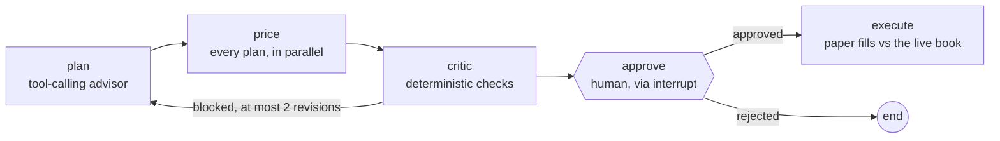

# Quant Trade Simulator

[](https://github.com/Arittra-Bag/Quant-Trade-Simulator/actions/workflows/ci.yml)

[](LICENSE)
[](https://quant-trade-simulator.onrender.com)

**[Try it live](https://quant-trade-simulator.onrender.com)** (hosted on Render, so the first
request may take a few seconds to wake the instance).

**A pre-trade transaction cost simulator for crypto perpetuals.** Point it at a live L2
order book, size an order, and it tells you what that order would cost to execute right
now: slippage from walking the actual book, market impact, exchange fees, the maker/taker
split, and the VWAP your fill would land at, in USD and in basis points of notional.


<sub>Recorded against the built-in simulated feed, which is what the app falls back to when
exchange WebSockets are unreachable. Live venues drive exactly the same path.</sub>

## What it measures

| Output | How it is computed |
| --- | --- |
| **Slippage** | Walks the resting book level by level until the notional is filled, then `abs(VWAP - mid) / mid * notional`. Includes the half-spread, which is what a market order actually pays. Anything past the last visible level is priced by continuing the book at its own average depth density, and the result says how much of the order that was. |
| **Market impact** | The permanent residue of that same walk: `PERMANENT_SHARE * end displacement * notional`. The temporary part is already in the fill price, so it is not charged twice. The square-root law is available as a cross-check, not as a second term. |
| **Fees** | Per-venue maker and taker schedules, blended by the maker probability. |
| **Net cost** | Spread + depth + fees + permanent impact, shown in USD and bps. Timing risk is reported beside it as a one-sigma band, not added in. |
| **Maker/taker** | A market order is 0% maker. A passive limit at the touch is `1 / (1 + Q / queue_usd)`, falling as the order grows against the queue ahead of it. |
| **Calculation latency** | Wall-clock per tick for the model pass and render prep, reported as p50 and p99. |

Books come from OKX (`books5`), Hyperliquid, Binance USD-M futures or Kraken, with automatic
fallback to the next venue when one is unreachable or accepts the connection but never sends
data. OKX swap sizes are converted from contracts to base units using the instrument's
contract value. The header shows which venue is actually live, and whether the feed is
connecting, stale or offline.

## Scope and limits

This is a cost *estimator*, not a validated execution model. Being specific about that:

- **The cost model has not been calibrated against real fills.** `PERMANENT_SHARE = 0.4` is a
  literature value, not a fitted one. `validation/` exists to fit it against the public tape,
  and the one recording taken so far could not: about 400k rests at BTC's touch, so no sample
  walked the book. Treat the impact number as a shape that responds correctly to size, not as
  a number you would size a trade on.
- **Liquidity past the visible book is an assumption.** Depth is the top of book, 25 levels on
  the venues used here. Beyond it the walk continues the book at the average density of the
  levels it can see, which is stated in the result rather than hidden; a real book that thins
  out faster would cost more.
- **Fee schedules are a dated snapshot**, read off each venue's own page rather than fetched
  live, so they drift as venues change their ladders.
- **The AI advisor is measured, but on a small sample.** CI runs the eval offline against
  recorded fixtures; the live models were scored once per scenario (below), which ranks them
  but does not bound their variance.
- **Polling UI, one shared feed per server.** This is pre-trade analysis, not an execution
  system, and a public deployment should be treated as single-user.

## Quickstart

```bash
python -m venv .venv
source .venv/bin/activate          # Windows: .venv\Scripts\activate
pip install -r requirements.txt
python app.py                      # dev server on $PORT (default 8050)
./start.sh                         # production: gunicorn, configured by gunicorn.conf.py
```

Open <http://localhost:8050>, pick a venue and press **Start stream**. Choose **Simulated**
if exchange feeds are blocked from where you are running it.

Optional, for the AI panel, create a `.env` (never committed):

```
GEMINI_API_KEY=your_key_here
# GEMINI_MODEL=gemini-3.5-flash-lite            # default; fastest and cheapest on the live eval
# GEMINI_FALLBACK_MODELS=gemini-3.8-flash       # tried if the default is retired, busy or out of quota
# GEMINI_DAILY_REQUESTS=150                     # advisor requests per UTC day before the rules answer
```

The feed client also runs standalone, writing `latest_orderbook.json` and `feed_status.json`:

```bash
python websocket_client.py --symbol BTC-USDT-SWAP --exchange OKX
```

`ORDERBOOK_WS_URL_<VENUE>` (for example `ORDERBOOK_WS_URL_OKX`) overrides a venue's endpoint.

## Execution agent

**Plan** in the Execution agent panel runs a LangGraph state machine from the order to a
paper fill, with a human approval step before anything is sent:



- **plan**: the advisor from the AI panel proposes a strategy, with the same daily cap, model
  fallback and rules baseline. On a revision it is given the critic's findings.
- **price**: the advised plan and its alternatives (one clip, resting limit, TWAP x4, TWAP x10)
  are priced against the same book, fanned out with `Send`.
- **critic**: plain Python, not a second model. It blocks a plan whose cited cost is not what
  the plan prices at, whose side is wrong, that sends a single clip into a book too thin to
  fill it, or that trades an order more than 10x the visible depth; it notes a much cheaper
  alternative without blocking. A blocked plan goes back to the planner, at most twice, then
  to the human with the findings marked unresolved.
- **approve**: `interrupt()` pauses the run and an in-memory checkpointer holds it until you
  press Approve or Reject. An approval more than 2 minutes after planning is refused,
  because the book it was priced on has moved.
- **execute**: each child order is filled by walking the latest book from the feed, and the
  result is the implementation shortfall against the arrival mid, next to the planned cost.
  The horizon is compressed to a quarter-second between slices, and nothing leaves the process.

The critic enforces the same rules the evals grade (`advisor/policy.py`). Run over the 32
recorded live answers, it blocks the 3 the graders fail and none of the 29 they pass; over
the 40 replay-fixture answers it blocks 25 of 26 failures, with no false alarms
([method and every case](evals/CRITIC.md)). Because the rules are shared, that shows the
critic enforces what the evals measure, not that the rules are right. The one miss is a
scenario judgment the critic cannot see: a TWAP for a $1,000 order.

LangGraph is imported on the first **Plan**, not at start-up; it adds about 33 MB then.

## AI advisor evals

The advisor is a tool-calling loop: the model prices the order with the same cost functions
the desk uses (`quote_order`, `get_depth_profile`, `compare_schedule`, `get_book_stats`) and
answers in a fixed JSON schema. `evals/` scores it on 8 recorded books, from a small buy into
a deep book to an order larger than everything visible, with graders for schema, side,
whether the cost it cites is one the book quotes for its plan, whether it admits when the book
cannot show the fill, and tool economy. Offline replay fixtures, each built to break one
grader, prove the graders catch what they claim to.

Live run, one sample per scenario ([full results](evals/RESULTS.md)):

| Model | Score | Scenarios without a critical failure | Mean latency | Tokens per run | Cost per run |
| --- | ---: | ---: | ---: | ---: | ---: |
| `claude-haiku-4-5` | 99.5% | 8/8 | 12.8 s | 8,322 | $0.011 |
| `gemini-3.5-flash-lite` | 98.4% | 7/8 | 6.1 s | 6,170 | GCP credit |
| `claude-sonnet-5` (effort low) | 98.4% | 8/8 | 11.1 s | 8,392 | $0.012 |
| `gemini-3.8-flash` | 97.5% | 7/8 | 16.1 s | 14,661 | GCP credit |
| rules baseline | 100.0% | 8/8 | 0.1 ms | - | - |

What it shows:

- **The models are close.** 97.5 to 99.5% on one sample each is not a ranking to trust at the
  second digit. Each model lost points on at most one scenario.
- **The misses are on the hard books.** Of the 32 live answers, 4 failed a check: 3.8 Flash
  advised waiting on a $50M order without saying it is 2,500x the visible book; Flash Lite
  described a sell as a buy; Sonnet advised an iceberg for that same $50M order, where only
  waiting is defensible; Haiku repeated an identical tool call. The first three are what the
  execution agent's critic now blocks.
- **The bigger Gemini did not earn its cost.** 3.8 Flash scored no better than Flash Lite and
  took 2.6x as long on 2.4x the tokens, so the app leads with Flash Lite and keeps 3.8 Flash
  as the fallback.
- **The grader was wrong before the models were.** The first write-up of this run reported
  cost grounding as the most common miss, 8 of 32 answers. Every one of those 8 was a TWAP or
  iceberg citing the exact cost `compare_schedule` quoted for its own slice count, and the
  grader only accepted the one-clip cost. The grader now accepts the plan's own price, and
  `--regrade` re-scored the saved answers without calling a model again.
- **The rules baseline scores 100% by construction.** The graders encode the same thresholds,
  so it is a consistency check on the harness, not a bar the models are expected to clear.

```bash
python -m evals.runner                                  # offline, what CI runs
python -m evals.runner --live --max-usd 0.50            # every live model whose key is set
python -m evals.runner --regrade evals/results.json --markdown evals/RESULTS.md
python -m evals.critic_eval --markdown evals/CRITIC.md  # the agent's critic vs the graders
```

## Tests

```bash
pip install -r requirements-dev.txt
python -m pytest -q
```

262 tests, fully offline: every venue parser, the cost models, the CSV and Excel exports, the
advisor loop and both model transports against mocked APIs, the eval graders, the execution
agent's graph, critic and paper fills, and the feed client driven against local WebSocket
servers, including the case where a venue accepts the connection but never sends a book,
which must trigger fallback. CI runs the same
suite on Python 3.11 and 3.12 on every pull request and on every push to `main`, plus an
import check that the app loads with no feed and no API key.

## How it fits together

| File | Role |
| --- | --- |
| `app.py` | Dash app: layout, callbacks, feed supervision |
| `websocket_client.py` | Multi-venue L2 client, normalisation and venue fallback |
| `models.py` | Walk-the-book slippage, permanent impact, measured volatility, maker/taker, book statistics |
| `fee_model.py` | Per-venue maker and taker fee schedules |
| `visualizations.py` | Depth, cost-stack and latency charts |
| `gemini_integration.py` | The AI panel: Gemini advisor with fallback, daily cap and rules baseline |
| `advisor/` | Tool-calling advisor loop, tools, schema, Gemini and Claude transports |
| `agent/` | Execution agent: LangGraph graph, critic, paper execution, planners |
| `evals/` | Scenarios, graders, replay fixtures, the eval runner and the critic eval |
| `export.py` | CSV and Excel export of the current book |
| `validation/` | Records books and the public trade tape; scores predicted cost, and the agent's plans (`posttrade.py`), against it |
| `assets/theme.css` | Desk theme, served automatically by Dash |

`DOCUMENTATION.md` has the model derivations and the environment configuration in full, and
`COST_MODEL.md` sets out which parts of a quote are measured and which are still assumptions.

## Running on a free instance

The live demo runs on a free web instance (a fraction of a CPU) with a capped Gemini budget, so
the desk is built to stay responsive on both:

- **Self-paced polling.** The browser asks for the next update only once the last one has
  answered, at most twice a second, and every 5 s while the tab is hidden. A slow link
  updates less often instead of freezing.
- **Send only what changed.** A poll whose book and order are unchanged returns the feed
  state and the ages, not the ladder, tiles and charts again.
- **Cheap charts.** Figures are built as plain dicts rather than `go.Figure` objects, which
  took a poll from about 55 ms of server time to about 2 ms. The tests still validate every
  figure through plotly.
- **Compressed responses.** A live poll is about 3.5 KB on the wire instead of 22 KB, and the
  compressed JS bundles are cached, not rebuilt for every visitor.
- **Threaded worker.** Start, Stop and the advisor never wait behind the polls.
- **Advisor quota.** Generate is locked while a request is running and requests are spaced
  at least 5 s apart. Flash Lite leads because it was the fastest model on the live eval
  and scored no worse, 3.8 Flash is the fallback, and a daily cap (150 requests by default) keeps a public page from running up a bill.
  A model that fails is rested instead of being tried first on every call: until midnight
  Pacific for a spent daily quota, for Google's retry delay (or 60 s) for a per-minute quota,
  and 30 s when overloaded or timed out. A click has a 40 s budget. When Gemini cannot answer,
  the panel gives the rules-based read and says why, rather than an error.

## Notes

- Binance and OKX restrict some regions. The client falls through to the next venue rather
  than failing, and the header names whichever one is live.
- Dependencies are pinned so a redeploy cannot silently pull a breaking release.

## License

Apache 2.0. See [LICENSE](LICENSE).
