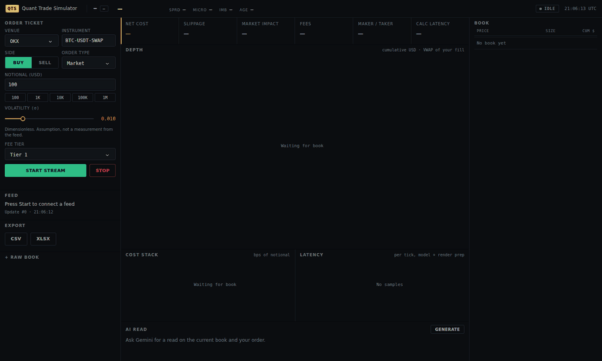

# Quant Trade Simulator

[](https://github.com/Arittra-Bag/Quant-Trade-Simulator/actions/workflows/ci.yml)

[](LICENSE)
[](https://quant-trade-simulator.onrender.com)

**[Try it live](https://quant-trade-simulator.onrender.com)** (hosted on Render, so the first
request may take a few seconds to wake the instance).

**A pre-trade transaction cost simulator for crypto perpetuals.** Point it at a live L2
order book, size an order, and it tells you what that order would cost to execute right
now: slippage from walking the actual book, market impact, exchange fees, the maker/taker
split, and the VWAP your fill would land at, in USD and in basis points of notional.



<sub>Recorded against the built-in simulated feed, which is what the app falls back to when
exchange WebSockets are unreachable. Live venues drive exactly the same path.</sub>

## What it measures

| Output | How it is computed |
| --- | --- |
| **Slippage** | Walks the resting book level by level until the notional is filled, then `abs(VWAP - mid) / mid * notional`. Includes the half-spread, which is what a market order actually pays. Anything past the last visible level is priced by continuing the book at its own average depth density, and the result says how much of the order that was. |
| **Market impact** | The permanent residue of that same walk: `PERMANENT_SHARE * end displacement * notional`. The temporary part is already in the fill price, so it is not charged twice. The square-root law is available as a cross-check, not as a second term. |
| **Fees** | Per-venue maker and taker schedules, blended by the maker probability. |
| **Net cost** | Spread + depth + fees + permanent impact, shown in USD and bps. Timing risk is reported beside it as a one-sigma band, not added in. |
| **Maker/taker** | A market order is 0% maker. A passive limit at the touch is `1 / (1 + Q / queue_usd)`, falling as the order grows against the queue ahead of it. |
| **Calculation latency** | Wall-clock per tick for the model pass and render prep, reported as p50 and p99. |

Books come from OKX (`books5`), Hyperliquid, Binance USD-M futures or Kraken, with automatic
fallback to the next venue when one is unreachable or accepts the connection but never sends
data. OKX swap sizes are converted from contracts to base units using the instrument's
contract value. The header shows which venue is actually live, and whether the feed is
connecting, stale or offline.

## Scope and limits

This is a cost *estimator*, not a validated execution model. Being specific about that:

- **The cost model has not been calibrated against real fills.** `PERMANENT_SHARE = 0.4` is a
  literature value, not a fitted one. `validation/` exists to fit it against the public tape,
  and the one recording taken so far could not: about 400k rests at BTC's touch, so no sample
  walked the book. Treat the impact number as a shape that responds correctly to size, not as
  a number you would size a trade on.
- **Liquidity past the visible book is an assumption.** Depth is the top of book, 25 levels on
  the venues used here. Beyond it the walk continues the book at the average density of the
  levels it can see, which is stated in the result rather than hidden; a real book that thins
  out faster would cost more.
- **Fee schedules are a dated snapshot**, read off each venue's own page rather than fetched
  live, so they drift as venues change their ladders.
- **The Gemini panel is not covered by the tests or CI.** There is no recorded fixture and no
  eval for it; it is optional, off by default, and needs a key you supply.
- **500 ms polling UI, one shared feed per server process.** This is pre-trade analysis, not
  an execution system, and a public deployment should be treated as single-user.

## Quickstart

```bash
python -m venv .venv
source .venv/bin/activate          # Windows: .venv\Scripts\activate
pip install -r requirements.txt
python app.py                      # or ./start.sh; serves on $PORT (default 8050)
```

Open <http://localhost:8050>, pick a venue and press **Start stream**. Choose **Simulated**
if exchange feeds are blocked from where you are running it.

Optional, for the AI panel, create a `.env` (never committed):

```
GEMINI_API_KEY=your_key_here
# GEMINI_MODEL=gemini-3.8-flash                 # default
# GEMINI_FALLBACK_MODELS=gemini-3.5-flash-lite  # tried if the default is retired
```

The feed client also runs standalone, writing `latest_orderbook.json` and `feed_status.json`:

```bash
python websocket_client.py --symbol BTC-USDT-SWAP --exchange OKX
```

`ORDERBOOK_WS_URL_<VENUE>` (for example `ORDERBOOK_WS_URL_OKX`) overrides a venue's endpoint.

## Tests

```bash
pip install -r requirements-dev.txt
python -m pytest -q
```

26 tests, fully offline: every venue parser, the cost models, the CSV and Excel exports, and
the feed client driven against local WebSocket servers, including the case where a venue
accepts the connection but never sends a book, which must trigger fallback. CI runs the same
suite on Python 3.11 and 3.12 on every pull request and on every push to `main`, plus an
import check that the app loads with no feed and no API key.

## How it fits together

| File | Role |
| --- | --- |
| `app.py` | Dash app: layout, callbacks, feed supervision |
| `websocket_client.py` | Multi-venue L2 client, normalisation and venue fallback |
| `models.py` | Walk-the-book slippage, permanent impact, measured volatility, maker/taker, book statistics |
| `fee_model.py` | Per-venue maker and taker fee schedules |
| `visualizations.py` | Depth, cost-stack and latency charts |
| `gemini_integration.py` | Optional Gemini read on the book |
| `export.py` | CSV and Excel export of the current book |
| `validation/` | Records books and the public trade tape, and scores predicted cost against it |
| `assets/theme.css` | Desk theme, served automatically by Dash |

`DOCUMENTATION.md` has the model derivations and the environment configuration in full, and
`COST_MODEL.md` sets out which parts of a quote are measured and which are still assumptions.

## Notes

- Binance and OKX restrict some regions. The client falls through to the next venue rather
  than failing, and the header names whichever one is live.
- Dependencies are pinned so a redeploy cannot silently pull a breaking release.

## License

Apache 2.0. See [LICENSE](LICENSE).
